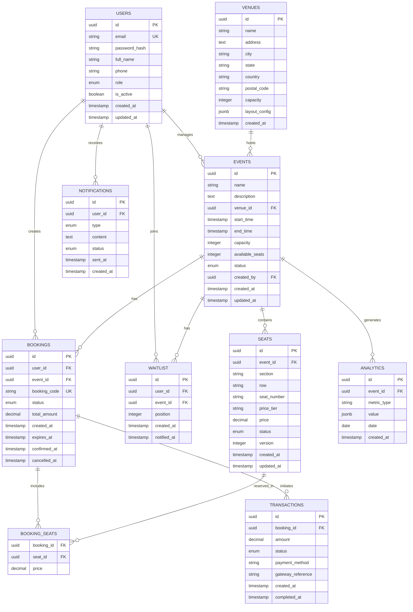

# 📊 Entity Relationship Diagram

## Database Schema Overview

The Evently platform uses PostgreSQL as its primary database with the following entity relationships:

## Entity Relationship Diagram



## Entity Details

### 1. USERS
**Purpose**: Store user account information and authentication details

| Column | Type | Constraints | Description |
|--------|------|------------|-------------|
| id | UUID | PRIMARY KEY | Unique identifier |
| email | VARCHAR(255) | UNIQUE, NOT NULL | User email address |
| password_hash | VARCHAR(255) | NOT NULL | Bcrypt hashed password |
| full_name | VARCHAR(255) | NOT NULL | User's full name |
| phone | VARCHAR(20) | | Phone number |
| role | VARCHAR(20) | DEFAULT 'user' | Role: user, admin, organizer |
| is_active | BOOLEAN | DEFAULT true | Account status |
| created_at | TIMESTAMP | DEFAULT NOW() | Registration timestamp |
| updated_at | TIMESTAMP | DEFAULT NOW() | Last update timestamp |

### 2. VENUES
**Purpose**: Store venue information where events are hosted

| Column | Type | Constraints | Description |
|--------|------|------------|-------------|
| id | UUID | PRIMARY KEY | Unique identifier |
| name | VARCHAR(255) | NOT NULL | Venue name |
| address | TEXT | NOT NULL | Street address |
| city | VARCHAR(100) | NOT NULL | City name |
| state | VARCHAR(100) | | State/Province |
| country | VARCHAR(100) | NOT NULL | Country |
| postal_code | VARCHAR(20) | | Postal/ZIP code |
| capacity | INTEGER | NOT NULL | Maximum capacity |
| layout_config | JSONB | | Seating layout configuration |
| created_at | TIMESTAMP | DEFAULT NOW() | Creation timestamp |

### 3. EVENTS
**Purpose**: Store event information and metadata

| Column | Type | Constraints | Description |
|--------|------|------------|-------------|
| id | UUID | PRIMARY KEY | Unique identifier |
| name | VARCHAR(255) | NOT NULL | Event name |
| description | TEXT | | Event description |
| venue_id | UUID | FOREIGN KEY | Reference to venue |
| start_time | TIMESTAMP | NOT NULL | Event start time |
| end_time | TIMESTAMP | NOT NULL | Event end time |
| capacity | INTEGER | NOT NULL | Total capacity |
| available_seats | INTEGER | NOT NULL | Currently available seats |
| status | VARCHAR(20) | DEFAULT 'upcoming' | Event status |
| created_by | UUID | FOREIGN KEY | Creator user ID |
| created_at | TIMESTAMP | DEFAULT NOW() | Creation timestamp |
| updated_at | TIMESTAMP | DEFAULT NOW() | Last update timestamp |

### 4. SEATS
**Purpose**: Store individual seat information for events

| Column | Type | Constraints | Description |
|--------|------|------------|-------------|
| id | UUID | PRIMARY KEY | Unique identifier |
| event_id | UUID | FOREIGN KEY | Reference to event |
| section | VARCHAR(50) | | Seat section |
| row | VARCHAR(10) | | Row identifier |
| seat_number | VARCHAR(10) | | Seat number |
| price_tier | VARCHAR(20) | | Pricing tier |
| price | DECIMAL(10,2) | NOT NULL | Seat price |
| status | VARCHAR(20) | DEFAULT 'available' | Seat status |
| version | INTEGER | DEFAULT 0 | Optimistic lock version |
| created_at | TIMESTAMP | DEFAULT NOW() | Creation timestamp |
| updated_at | TIMESTAMP | DEFAULT NOW() | Last update timestamp |

### 5. BOOKINGS
**Purpose**: Store booking transactions and their status

| Column | Type | Constraints | Description |
|--------|------|------------|-------------|
| id | UUID | PRIMARY KEY | Unique identifier |
| user_id | UUID | FOREIGN KEY | Reference to user |
| event_id | UUID | FOREIGN KEY | Reference to event |
| booking_code | VARCHAR(20) | UNIQUE, NOT NULL | Unique booking reference |
| status | VARCHAR(20) | DEFAULT 'pending' | Booking status |
| total_amount | DECIMAL(10,2) | NOT NULL | Total booking amount |
| created_at | TIMESTAMP | DEFAULT NOW() | Booking creation time |
| expires_at | TIMESTAMP | | Reservation expiry time |
| confirmed_at | TIMESTAMP | | Confirmation timestamp |
| cancelled_at | TIMESTAMP | | Cancellation timestamp |

### 6. BOOKING_SEATS
**Purpose**: Junction table linking bookings to specific seats

| Column | Type | Constraints | Description |
|--------|------|------------|-------------|
| booking_id | UUID | FOREIGN KEY, PK | Reference to booking |
| seat_id | UUID | FOREIGN KEY, PK | Reference to seat |
| price | DECIMAL(10,2) | NOT NULL | Seat price at booking time |

### 7. TRANSACTIONS
**Purpose**: Store payment transaction details

| Column | Type | Constraints | Description |
|--------|------|------------|-------------|
| id | UUID | PRIMARY KEY | Unique identifier |
| booking_id | UUID | FOREIGN KEY | Reference to booking |
| amount | DECIMAL(10,2) | NOT NULL | Transaction amount |
| status | VARCHAR(20) | DEFAULT 'pending' | Transaction status |
| payment_method | VARCHAR(50) | | Payment method used |
| gateway_reference | VARCHAR(255) | | Payment gateway reference |
| created_at | TIMESTAMP | DEFAULT NOW() | Transaction initiation |
| completed_at | TIMESTAMP | | Transaction completion |

### 8. WAITLIST
**Purpose**: Manage waitlist for sold-out events

| Column | Type | Constraints | Description |
|--------|------|------------|-------------|
| id | UUID | PRIMARY KEY | Unique identifier |
| user_id | UUID | FOREIGN KEY | Reference to user |
| event_id | UUID | FOREIGN KEY | Reference to event |
| position | INTEGER | NOT NULL | Position in waitlist |
| created_at | TIMESTAMP | DEFAULT NOW() | Join timestamp |
| notified_at | TIMESTAMP | | Notification sent timestamp |

### 9. NOTIFICATIONS
**Purpose**: Track system notifications sent to users

| Column | Type | Constraints | Description |
|--------|------|------------|-------------|
| id | UUID | PRIMARY KEY | Unique identifier |
| user_id | UUID | FOREIGN KEY | Reference to user |
| type | VARCHAR(50) | NOT NULL | Notification type |
| content | TEXT | NOT NULL | Notification content |
| status | VARCHAR(20) | DEFAULT 'pending' | Delivery status |
| sent_at | TIMESTAMP | | Actual send timestamp |
| created_at | TIMESTAMP | DEFAULT NOW() | Creation timestamp |

### 10. ANALYTICS
**Purpose**: Store aggregated analytics data for reporting

| Column | Type | Constraints | Description |
|--------|------|------------|-------------|
| id | UUID | PRIMARY KEY | Unique identifier |
| event_id | UUID | FOREIGN KEY | Reference to event |
| metric_type | VARCHAR(50) | NOT NULL | Type of metric |
| value | JSONB | NOT NULL | Metric value (flexible) |
| date | DATE | NOT NULL | Date of metric |
| created_at | TIMESTAMP | DEFAULT NOW() | Creation timestamp |

## Relationships

### One-to-Many Relationships
- **USERS → BOOKINGS**: One user can have many bookings
- **USERS → EVENTS**: One user can create many events (as organizer)
- **VENUES → EVENTS**: One venue can host many events
- **EVENTS → SEATS**: One event has many seats
- **EVENTS → BOOKINGS**: One event has many bookings
- **BOOKINGS → TRANSACTIONS**: One booking can have multiple transactions

### Many-to-Many Relationships
- **BOOKINGS ↔ SEATS** (through BOOKING_SEATS): A booking can include multiple seats, and seats can be in different bookings over time
- **USERS ↔ EVENTS** (through WAITLIST): Users can be on waitlists for multiple events

## Database Constraints

### Primary Keys
- All tables use UUID as primary key for distributed system compatibility

### Foreign Keys
- Proper cascading deletes where appropriate
- Restrict deletes for critical relationships

### Unique Constraints
- User email must be unique
- Booking code must be unique
- (event_id, section, row, seat_number) combination must be unique for seats
- (user_id, event_id) combination must be unique for waitlist

### Check Constraints
- Role must be in ('user', 'admin', 'organizer')
- Event status must be in ('upcoming', 'ongoing', 'completed', 'cancelled')
- Seat status must be in ('available', 'reserved', 'booked', 'blocked')
- Booking status must be in ('pending', 'confirmed', 'cancelled', 'expired')
- Transaction status must be in ('pending', 'success', 'failed', 'refunded')

## Indexes for Performance

### Primary Indexes
```sql
CREATE INDEX idx_events_start_time ON events(start_time);
CREATE INDEX idx_events_status ON events(status);
CREATE INDEX idx_seats_event_status ON seats(event_id, status);
CREATE INDEX idx_bookings_user ON bookings(user_id);
CREATE INDEX idx_bookings_event ON bookings(event_id);
CREATE INDEX idx_bookings_status ON bookings(status);
CREATE INDEX idx_waitlist_event ON waitlist(event_id);
CREATE INDEX idx_transactions_booking ON transactions(booking_id);
```

### Composite Indexes
```sql
CREATE INDEX idx_seats_availability
    ON seats(event_id, status)
    WHERE status = 'available';

CREATE INDEX idx_bookings_user_status
    ON bookings(user_id, status);

CREATE INDEX idx_events_upcoming
    ON events(start_time)
    WHERE status = 'upcoming';
```

## Partitioning Strategy

### Time-based Partitioning
- **Events table**: Partitioned by start_time (monthly)
- **Bookings table**: Partitioned by created_at (quarterly)
- **Analytics table**: Partitioned by date (monthly)

### Benefits
- Improved query performance for time-range queries
- Easier data archival and maintenance
- Better cache utilization

## Data Integrity Rules

1. **Seat Availability**: When a seat is booked, available_seats in events table must be decremented
2. **Booking Expiration**: Pending bookings must be cancelled after expiration time
3. **Waitlist Position**: Must be sequential without gaps
4. **Price Consistency**: Seat price in booking_seats must match the price at booking time
5. **Version Control**: Seat version must increment on every update for optimistic locking